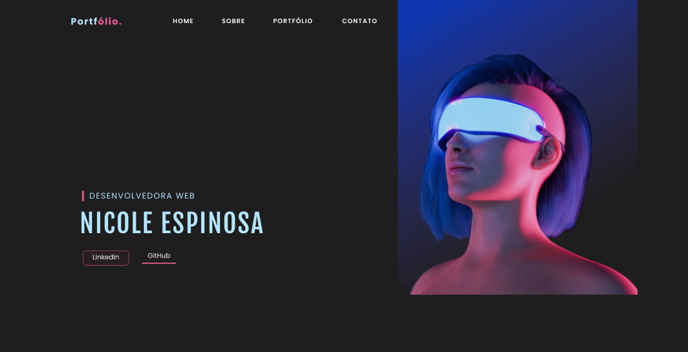

# Portfólio
Esse foi o meu primeiro portfólio, usei um vídeo do youtube para auxiliar, visto que ainda não possuo experiência.
Ainda está em construção, falta a responsividade e adicionar os projetos.
Possui diversas animações feitas com CSS e outras com JavaScript

## Tecnologias usadas

  
  
  

## Ferramentas
<a href="https://fonts.google.com">Google Fonts</a> |  <a href="https://iconscout.com">IconScout</a> |  <a href="https://www.kunkalabs.com/mixitup/">Mixitup</a> |  <a href="https://scrollrevealjs.org/">ScrollReveal</a>

## Vídeo

Esse é o vídeo do Youtube usado para auxílio:  
<a href="https://youtu.be/kk5dZVfCpgk">Create a Portfolio Website Using HTML & CSS & JavaScript | Light & Dark Theme </a> por <a href="https://www.youtube.com/c/TrueCoder">True Coder

  <a href="https://github.com/sefyudem">Clique aqui</a> para ir direto para o GitHub do proprietário do vídeo.

## Figma

  <a href="https://www.figma.com/file/OhbnGhRxQ1BjH2jYOsPMVN/Portfolio">Projeto no Figma</a>

### <a href="https://nicoleespinosa.github.io/portfolio-nicole/">Clique e irá direto para o portfólio!

